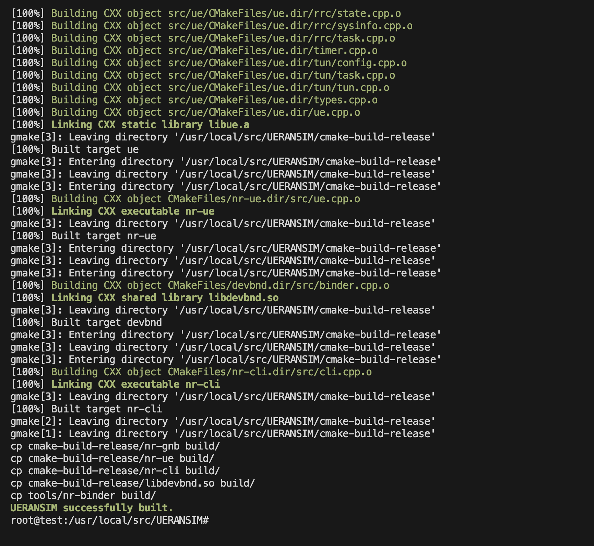
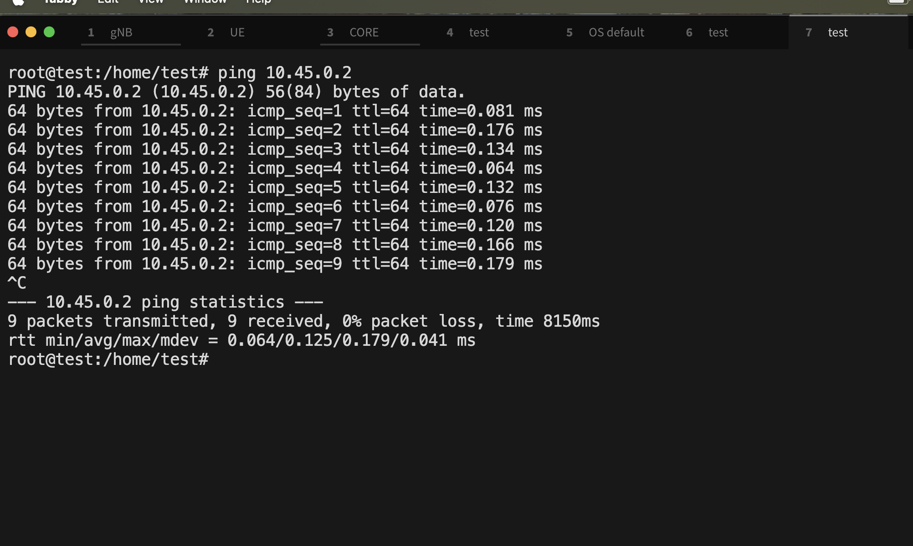

UERANSIM Installation Guide

This document is based on the official UERANSIM installation guide:
Website: https://github.com/aligungr/UERANSIM/wiki/Installation

1. Environment Setup

Use a Linux-based system (Debian/Ubuntu recommended).

If you do not have a Linux OS, create a virtual machine on Windows or macOS.

I have set up a VM environment and used that for this installation.

Login with user:
$ sudo su
Password: [Your Password]

2. Update Your System
sudo apt update

3. Install UERANSIM Dependencies
sudo apt install make
sudo apt install gcc
sudo apt install g++
sudo apt install libsctp-dev lksctp-tools
sudo apt install iproute2
sudo snap install cmake --classic

4. Build UERANSIM from Source
Specify the location where you want to install UERANSIM. For example:
cd /usr/local/src/
git clone https://github.com/aligungr/UERANSIM

5. Compile UERANSIM
cd /usr/local/src/UERANSIM/
make

6. After Successful Compilation

The compiled binaries will be located in the UERANSIM/build/ directory:

nr-cli: CLI tool for 5G UE and RAN interaction.
nr-gnb: Main executable for 5G gNodeB (gNB).
nr-ue: Main executable for 5G UE.
nr-binder: Tool to enable internet connectivity for UE.
libdevbnd.so: Dynamic library used by nr-binder.

Configuration of UERANSIM

1. Go to configuration directory

cd UERANSIM/config/

2. Key Elements to Configure When Connecting with Core
MCC - Mobile Country Code 
MNC - Mobile Network Code 
TAC - Tracking Area Code
gNB IP - IP Address of gNB
AMF IP - IP Address of AMF
NSSAI - Network Slice Selection Assistance Information(Combination of ssd and st value)
SUPI - Subscription Permanent Identifier (UE Identity)
K Value - Secret key for authentication
OPC Value - Operator Code used for security algorithms
APN - Access Point Network

3. Run UERANSIM After Configuration

After all the changes are made according to the requirement, run the following:

$ ./nr-gnb -c ../config/open5gs-gnb.yaml

$ ./nr-ue -c ../config/open5gs-ue.yaml

Alternate path if already in config directory:

$ ./../build/nr-gnb -c open5gs-gnb.yaml
$ ./../build/nr-ue -c open5gs-ue.yaml

If all configuration is applied correctly, then the UE and gNB should successfully connect with the core, and logs will be shown accordingly.

For more information attached wireshark packets also captured_pcap folder
