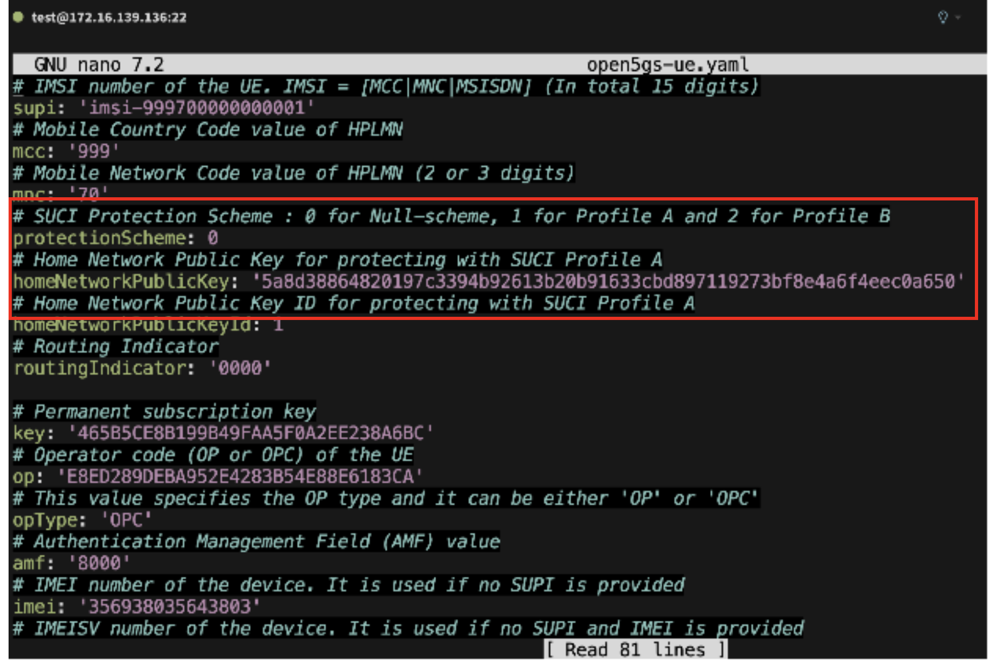
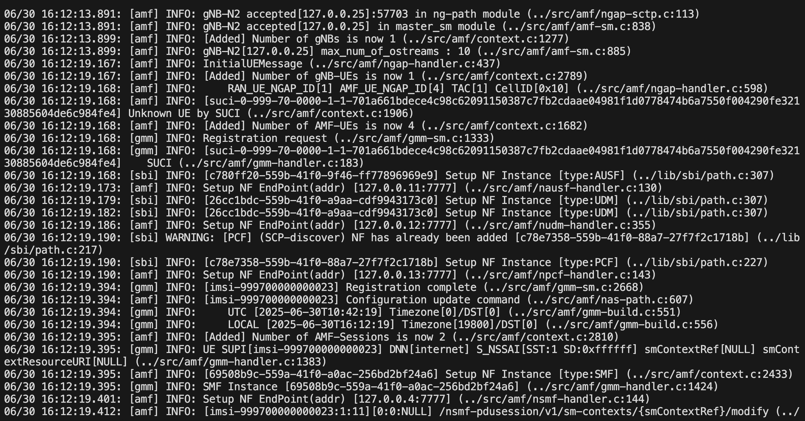
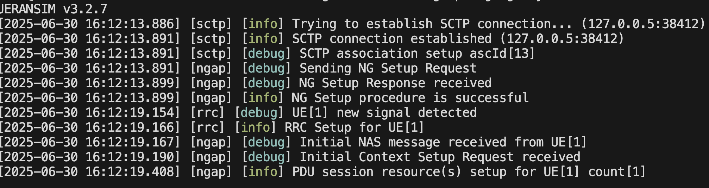
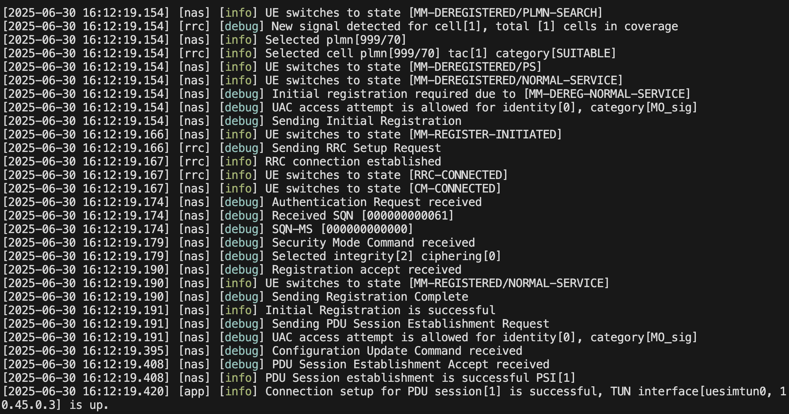
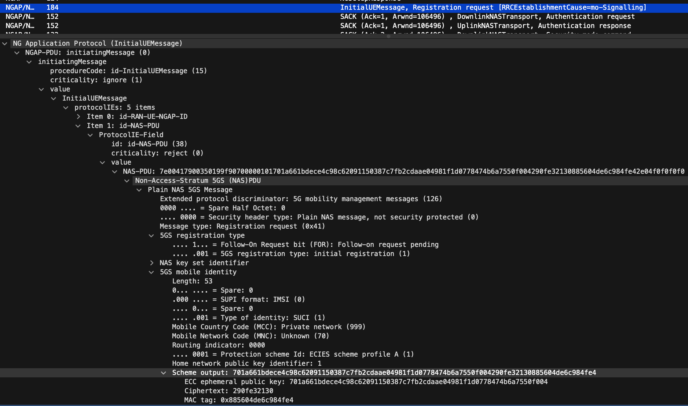

### Understanding SUPI Profiles in 5G

In 5G networks, the SUPI (Subscription Permanent Identifier) is a unique identifier for subscribers. Depending on the privacy profile used, SUPI may be protected in different ways when transmitted over the network.

### SUPI Protection Profiles

    Profile 0 (Null): No protection is applied to the SUPI. 
    Profile A (1): Provides protection using a public key encryption mechanism. 
    Profile B (2): Uses a different protection mechanism.

More info: 3GPP TS 23.003

### How to Configure Profile A in Open5GS and UERANSIM

### Step 1: Generate Public Key in Open5GS Core
    Navigate to the directory where Open5GS stores its public/private key pairs:
    $ cd /usr/local/src/open5gs/install/etc/open5gs/hnet
    $ ls -lrt

    You should see key files such as:

    -rw-r--r-- 1 root root 302 secp256r1-2.key
    -rw-r--r-- 1 root root 119 curve25519-1.key

To inspect a key:

    $ openssl pkey -in curve25519-1.key -text

For more details, refer to the udm.yaml file.

### Step 2: Add Public Key in UERANSIM

    $ cd /usr/local/src/UERANSIM/config
    $ nano open5gs-ue.yaml

Update the fields related to supi, key, and protection_scheme. Then save and exit.

### Step 3: Restart Open5GS Core Services

    Restart all Open5GS services to apply the key configuration:

    $ systemctl restart open5gs-amfd.service open5gs-scpd.service open5gs-ausfd.service \
    open5gs-hssd.service open5gs-mmed.service open5gs-nrfd.service open5gs-nssfd.service \
    open5gs-pcfd.service open5gs-pcrfd.service open5gs-smfd.service open5gs-sgwcd.service \
    open5gs-sgwud.service open5gs-udmd.service open5gs-udrd.service open5gs-upfd.service

To check the status of this type of service, you must first create a service unit file and enable it using systemd.

### Step 4: Run gNB and UE

Start the simulated gNB and UE:

    $ ./nr-gnb -c ../config/open5gs-gnb.yaml
    $ ./nr-ue -c ../config/open5gs-ue.yaml

### Step 5: View Core Logs

Tail AMF logs to verify the SUPI profile activity:

    $ tail -f /open5gs/install/var/log/open5gs/amf.log

### To adjust the logging level (helpful during debugging):

    $ nano amf.yaml  # Update the log level to debug/info/etc.
    $ systemctl restart open5gs-amfd.service 

### Step 6: Attached all logs files 
core

gNB

UE

Also pcap files

Important Notes
    Profile A is supported and tested with Open5GS and UERANSIM.
    Profile B is not currently supported in UERANSIM.

Note:
    I completed the integration of open-source tools for learning purposes, primarily using official documentation from Open5GS and UERANSIM.

e421686f6fb2d70e3fa28d940494095686c3179fef53514667a6ed106b8a7d3d

ce250543128636d15a187b881b7d158148363b0590382dc90bd536ab76602b37