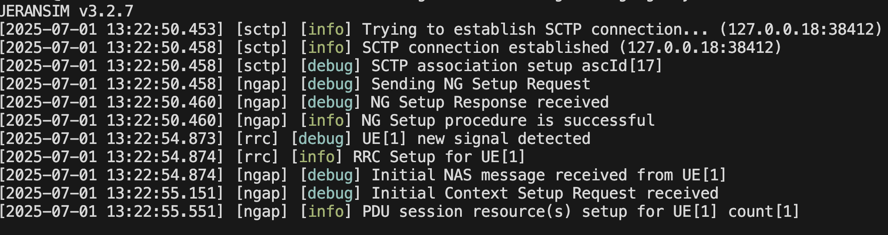
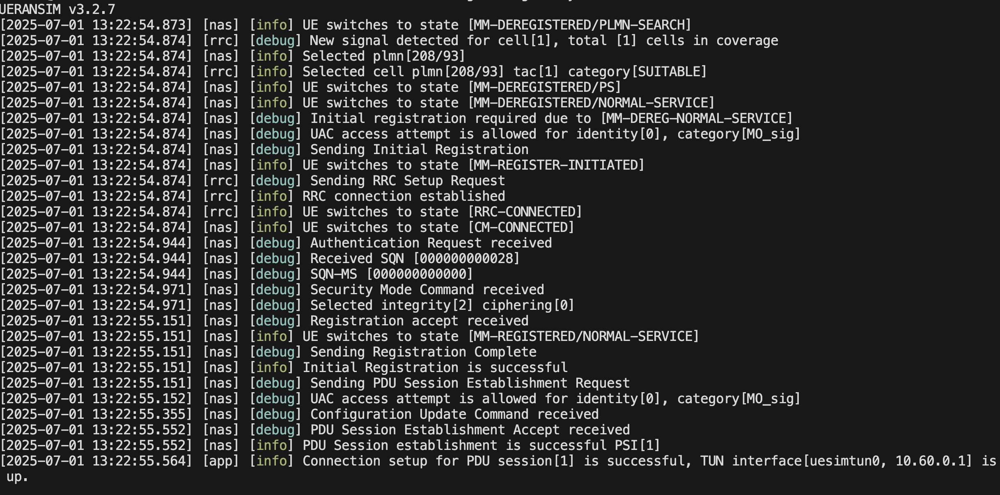
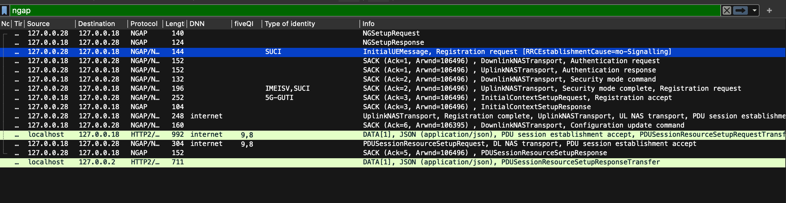
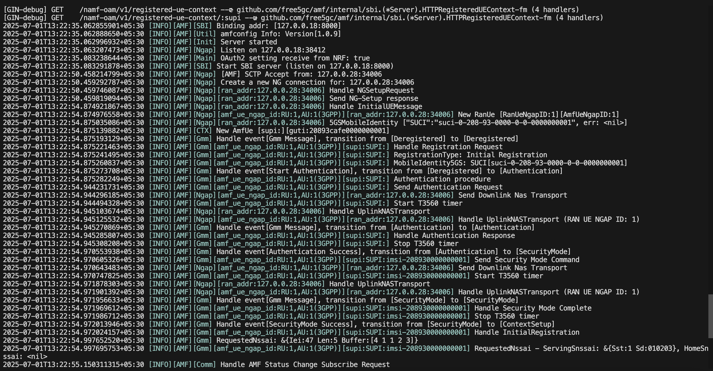
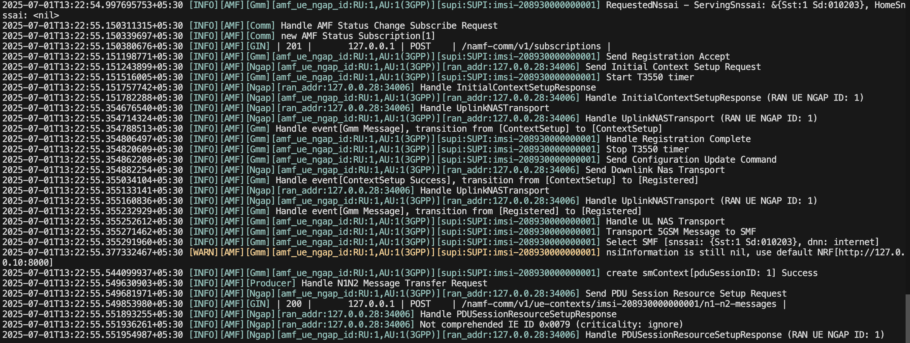

### Free5GC Installation Guide

This document is based on the official UERANSIM installation guide:
Website: https://free5gc.org/guide/3-install-free5gc/

## 1. Environment Setup

Use a Linux-based system (Debian/Ubuntu recommended).

If you do not have a Linux OS, create a virtual machine on Windows or macOS.
I have set up a VM environment and used that for this installation.

## Login with user:
    $ sudo su
    $ Enter Password

## 2. Update Your System
    $ sudo apt update

## 3. Install free5gc Dependencies(Prerequisites)
        1. Linux Kernel Version (for UPF)
        Recommended: 5.0.0-23-generic or 5.4.x (e.g., 5.4.0-65-generic)

        Check kernel version:
        $ uname -r

        2. Golang Installation (v1.21.8)
        $ go version
        If the version is not 1.21.8, remove the existing Go version and install the required one:
        $ sudo rm -rf /usr/local/go
        $ wget https://dl.google.com/go/go1.21.8.linux-amd64.tar.gz
        $ sudo tar -C /usr/local -xzf go1.21.8.linux-amd64.tar.gz

        $ mkdir -p ~/go/{bin,pkg,src}
        $ echo 'export GOPATH=$HOME/go' >> ~/.bashrc
        $ echo 'export GOROOT=/usr/local/go' >> ~/.bashrc
        $ echo 'export PATH=$PATH:$GOPATH/bin:$GOROOT/bin' >> ~/.bashrc
        $ echo 'export GO111MODULE=auto' >> ~/.bashrc
        $ source ~/.bashrc

        $ sudo apt -y update
        $ sudo apt -y install wget git
        $ lscpu | grep avx
        3. MongoDB Installation 
        $ sudo apt -y install git gcc g++ cmake autoconf libtool pkg-config libmnl-dev libyaml-dev

## 4. Linux Host Network Settings

    $ sudo sysctl -w net.ipv4.ip_forward=1
    $ sudo iptables -t nat -A POSTROUTING -o <dn_interface> -j MASQUERADE
    $ sudo iptables -A FORWARD -p tcp -m tcp --tcp-flags SYN,RST SYN -j TCPMSS --set-mss 1400
    $ sudo systemctl stop ufw
    $ sudo systemctl disable ufw

## 5.  Install Control Plane Elements
    $ cd ~
    $ git clone --recursive -b v4.0.1 -j $(nproc) https://github.com/free5gc/free5gc.git
    $ cd free5gc

    $ cd ~/free5gc
    $ git checkout main
    $ git submodule sync
    $ git submodule update --init --jobs $(nproc)
    $ git submodule foreach git checkout main
    $ git submodule foreach git pull --jobs $(nproc)

## 6. Build Network Functions
    $ cd ~/free5gc
    $ make  # Build all NFs
    $ make amf  # Build individual NF

### 7. Install User Plane Function (UPF)
    $ cd ~/free5gc
    $ git clone -b v0.9.14 https://github.com/free5gc/gtp5g.git
    $ cd gtp5g
    $ make
    $ sudo make install

### 8. Build UPF
    $ cd ~/free5gc
    $ make upf

### 9. Install WebConsole
    $ curl -fsSL https://deb.nodesource.com/setup_20.x | sudo -E bash -
    $ sudo apt update
    $ sudo apt install -y nodejs

## 10. Build WebConsole
    $ cd ~/free5gc
    $ make webconsole

## 11. After Successful Compilation
The compiled binaries will be located in the  directory:
    $ cd /usr/local/src/free5gc/bin/
    $ ./run.sh
    Run Individual Network Functions (NFs):
    Edit run.sh and comment out the unwanted NFs.
    Then run any NF manually:

    $ ./bin/amf       # Run AMF
    $ ./bin/smf       # Run SMF
    $ ./bin/upf       # Run UPF

    For webconsole:
    $ go run server.go 
    $ ./run.sh  # cd free5gc/webconsole

    Default Login
    Login: admin
    password: free5gc

    Here you add subscribers information

## 12. Configuration of UERANSIM and free5gc
save and restart services

## 13. Run UERANSIM After Configuration
## Run gNB
    $ ./nr-gnb -c ../config/free5gc-gnb.yaml

## 14. Run UE
    $ ./nr-ue -c ../config/free5gc-ue.yaml

## Alternate path if already in config directory:

    $ ./../build/nr-gnb -c free5gc-gnb.yaml
    $ ./../build/nr-ue -c free5gc-ue.yaml

Also pcap files

If all configuration is applied correctly, then the UE and gNB should successfully connect with the core, and logs will be shown accordingly.

For more information attached wireshark packets also captured_pcap folder

Note: 
    I completed the integration of open-source tools for learning purposes, primarily using official documentation from free5gc and UERANSIM.

Resources:
More Info visit Official Site: https://free5gc.org
MongoDB Docs: https://www.mongodb.com/docs
Go Lang Docs: https://golang.org/doc/install
