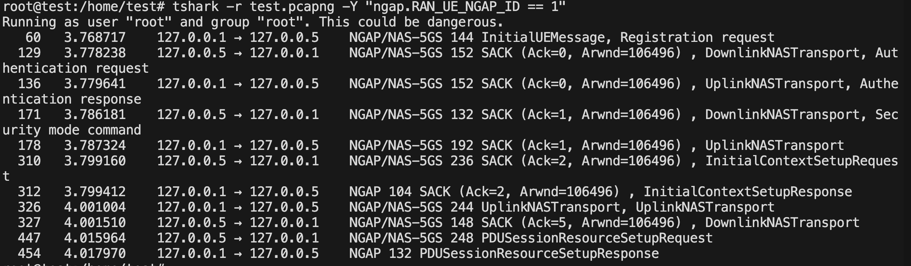

Protocol Analyzer Tools
    1. Wireshark
    GUI-based powerful protocol analyzer.
    Useful for visualizing packet flows, dissecting protocol layers, and applying filters.

    2. tcpdump
    Command-line packet analyzer.
    Useful on servers or minimal installations where Wireshark is not available.

    3. tshark
    Command-line version of Wireshark.
    Ideal for extracting and filtering specific protocol elements from .pcap files.

## tcpdump Commands:
    $ sudo tcpdump -i any -w file_name.pcapng  # Capture all traffic on all interfaces
    $ sudo tcpdump -i any sctp port 38412 -w ngap.pcapng # Capture NGAP (SCTP port 38412)
    $ sudo tcpdump -i any udp port 8805 -w pfcp.pcapng # Capture PFCP (UDP port 8805)
    $ sudo tcpdump -i any tcp port 7777 -w http2.pcapng # Capture HTTP/2 traffic (open5gs http2 port 7777)
    $ sudo tcpdump -i any udp port 2152 -w gtp.pcapng  # Capture GTP-U (UDP port 2152)

### example: 

    # Filter by NGAP RAN_UE_NGAP_ID
    $ tshark -r "UE_ngap_protocol.pcap" \ -Y "ngap.RAN_UE_NGAP_ID == 1"  # Run to show the output on terminal
    

    $ tshark -r "ue_ngap_protocol.pcap" \ -Y "ngap.RAN_UE_NGAP_ID == 114689" \  -w "NGAP.pcapng"  # Run to store data on pcap file
 

