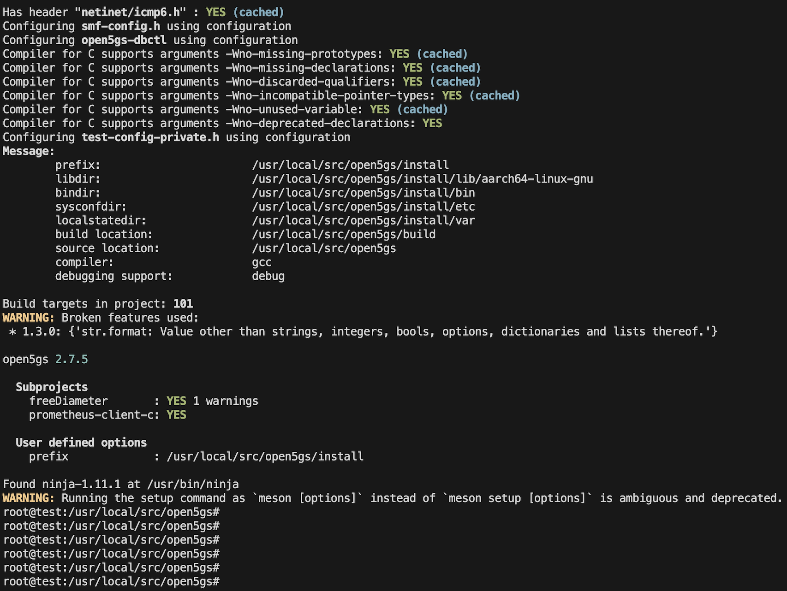

Open5GS Installation Guide
This document is based on the official Open5GS installation guide:
Website link: https://open5gs.org/open5gs/docs/guide/

Installation Methods
There are two ways to install Open5GS:

A. Building from Source(https://open5gs.org/open5gs/docs/guide/02-building-open5gs-from-sources/)
This method involves downloading the actual source code of Open5GS (from GitHub or official repositories) and manually compiling it on your system.

B. Using APT(https://open5gs.org/open5gs/docs/guide/01-quickstart/)
This method uses the APT package manager to install Open5GS with precompiled binaries—similar to any standard apt install process.

1. Environment Setup
Use a Linux-based system (Debian/Ubuntu recommended).

If you don’t have Linux, you can create a virtual machine on Windows or macOS.

In this guide, we use VM environment.
[ sudo su ]
# Enter your password
2. Update Your System
sudo apt update
3. Install MongoDB
Follow the official MongoDB installation guide for Ubuntu:
Website link: https://www.mongodb.com/docs/manual/tutorial/install-mongodb-on-ubuntu/
     

[this command to make MongoDB run every time you turn on the VM]

4. Create tunnel for open5gs
sudo ip tuntap add name ogstun mode tun
sudo ip addr add 10.45.0.1/16 dev ogstun
sudo ip addr add 2001:db8:cafe::1/48 dev ogstun
sudo ip link set ogstun up
     

4. Install common dependencies for building the source code
sudo apt install python3-pip python3-setuptools python3-wheel ninja-build build-essential flex bison git cmake \
libsctp-dev libgnutls28-dev libgcrypt-dev libssl-dev libmongoc-dev libbson-dev libyaml-dev \
libnghttp2-dev libmicrohttpd-dev libcurl4-gnutls-dev libtins-dev libtalloc-dev meson

5 . Install libidn-dev or libidn11-dev depending on your system

$ if apt-cache show libidn-dev > /dev/null 2>&1; then
    sudo apt-get install -y --no-install-recommends libidn-dev
else
    sudo apt-get install -y --no-install-recommends libidn11-dev
fi

6. Building from Source
    Specify the location where you want to install open5gs. For example:
    cd /usr/local/src/
    git clone https://github.com/open5gs/open5gs
    cd open5gs
    meson build --prefix=`pwd`/install
 
    ninja -C build
    Run Basic Tests
    ./build/tests/attach/attach                # For EPC Only
    ./build/tests/registration/registration    # For 5G Core Only
    Run All Tests
    cd build
    meson test -v
    Install Open5GS
    cd build
    cd ../

7. Building the WebUI of Open5GS
Node.js is required to build WebUI of Open5GS
$ sudo apt update
$ sudo apt install -y ca-certificates curl gnupg
$ sudo mkdir -p /etc/apt/keyrings
$ curl -fsSL https://deb.nodesource.com/gpgkey/nodesource-repo.gpg.key | sudo gpg --dearmor -o /etc/apt/keyrings/nodesource.gpg
$ NODE_MAJOR=20
$ echo "deb [signed-by=/etc/apt/keyrings/nodesource.gpg] https://deb.nodesource.com/node_$NODE_MAJOR.x nodistro main" | sudo tee /etc/apt/sources.list.d/nodesource.list
$ sudo apt update
$ sudo apt install nodejs -y
Install the dependencies to run WebUI
$ cd webui
$ npm ci
The WebUI runs as an npm script.
$ npm run dev
Server listening can be changed by setting the environment variable HOSTNAME or PORT as below.
$ HOSTNAME=192.168.0.11 npm run dev
$ PORT=7777 npm run dev

Register Subscriber Information
Connect to http://127.0.0.1:9999 and login with admin account.

Username : admin
Password : 1423
     

Second Method
step 1. Installing Using APT
    Add Repository and Install Open5GS
    sudo add-apt-repository ppa:open5gs/latest
    sudo apt update
    sudo apt install open5gs
step 2. Install the Open5GS WebUI
    Step 1: Download and Import NodeSource GPG Key
    sudo apt update
    sudo apt install -y ca-certificates curl gnupg
    sudo mkdir -p /etc/apt/keyrings
    curl -fsSL https://deb.nodesource.com/gpgkey/nodesource-repo.gpg.key | sudo gpg --dearmor -o /etc/apt/keyrings/nodesource.gpg
    Step 2: Add the Node.js Repository
    NODE_MAJOR=20
    echo "deb [signed-by=/etc/apt/keyrings/nodesource.gpg] https://deb.nodesource.com/node_$NODE_MAJOR.x nodistro main" | \
    sudo tee /etc/apt/sources.list.d/nodesource.list
    Step 3: Update and Install Node.js
    sudo apt update
    sudo apt install nodejs -y
    Step 4: Install Open5GS WebUI
    curl -fsSL https://open5gs.org/open5gs/assets/webui/install | sudo -E bash -  
 After successful build this type of page appears:
      
    
Notes
-> When using APT to install Open5GS, all necessary systemd service files are created automatically.
-> When building from source, you must manually create systemd service files for convenience and automatic startup.

After successful compiled open5gs then time to configuration
Go to location of config file
cd /usr/local/src/open5gs/install/etc/open5gs/

Changes according to need then save it and restart services 

Run individual network functions then 
$ ./install/bin/open5gs-amfd
$ ./install/bin/open5gs-nrfd
$ ./install/bin/open5gs-scpd
$ ./install/bin/open5gs-ausfd
$ ./install/bin/open5gs-pcfd
$ ./install/bin/open5gs-udmd
$ ./install/bin/open5gs-udrd
$ ./install/bin/open5gs-smfd
$ ./install/bin/open5gs-upfd
$ ./install/bin/open5gs-bsfd
$ ./install/bin/open5gs-nssfd

For All network functions 
$ ./build/tests/app/app

Here attached all log files
 
 

