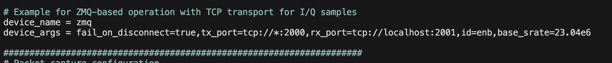
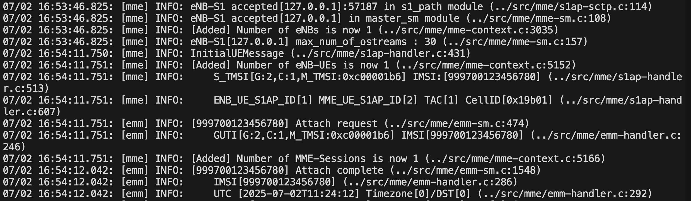
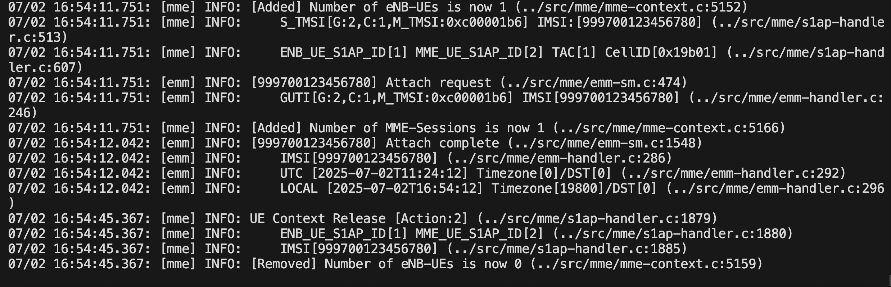
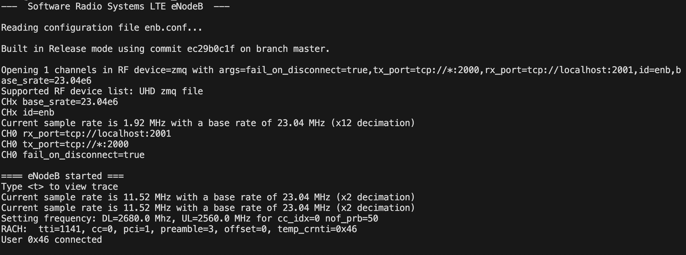
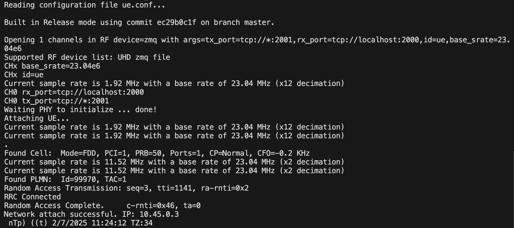
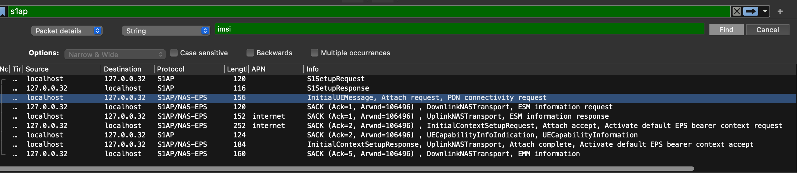

### Integration of Open5GS with srsRAN 4G Using ZeroMQ (Virtual RF)
This guide outlines the steps for integrating Open5GS with srsRAN_4G using ZeroMQ (virtual RF) for LTE testing in a loopback setup. The integration is intended for learning and validation using official documentation and open-source tools.

### Prerequisites and Dependencies 
    $ apt install build-essential cmake libfftw3-dev libmbedtls-dev libboost-program-options-dev libconfig++-dev libsctp-dev libzmq3-dev
    $ apt install gcc-11 g++-11
    $ update-alternatives --install /usr/bin/gcc gcc /usr/bin/gcc-11 11 --slave /usr/bin/g++ g++ /usr/bin/g++-11
    $ update-alternatives --install /usr/bin/gcc gcc /usr/bin/gcc-13 13 --slave /usr/bin/g++ g++ /usr/bin/g++-13
    $ update-alternatives --config gcc 
    $ gcc -v

### Clone and Build srsRAN_4G
    $ git clone https://github.com/srsran/srsRAN_4G.git
    $ cd srsRAN_4G
    $ mkdir build
    $ cd build
    $ cmake ../ -DENABLE_RF_PLUGINS=OFF
    $ make -j`nproc`

### Copy configuration files:
    ## srsenb Configuration
    $ cd srsRAN_4G/srsenb
    $ cp enb.conf.example ../build/srsenb/enb.conf
    $ cp rr.conf.example ../build/srsenb/rr.conf
    $ cp rb.conf.example ../build/srsenb/rb.conf
    $ cp sib.conf.example ../build/srsenb/sib.conf

    $ nano ../build/srsenb/enb.conf
    $ nano ../build/srsenb/rr.conf   #Use loopback IPs for testing.

### srsUE Configuration

    $ cd srsRAN_4G/srsue
    $ cp ue.conf.example ../build/srsue/ue.conf
    $ nano ../build/srsue/ue.conf # changes like opc,key mnc,mcc,imsi etc

    Note: Ensure that the necessary lines are uncommented in both the srsenb and srsue configuration files for proper operation.

### MME (Open5GS) Configuration
    $ nano open5gs/install/etc/open5gs/mme.yaml # Change IPAddress , MNC, MNC, TAC etc

### Run Services (open5GS MME)
    $ ./install/bin/open5gs-mmed

### Run srsenb
    $ cd srsRan_4G/build/srsenb
    $ ./src/srsenb enb.conf

### Run srsue
    $ cd srsRan_4G/build/srsue
    $ ./src/srsue ue.conf

If all configuration is applied correctly, then the UE and gNB should successfully connect with the core, and logs will be shown accordingly.

### Attached all logs files 
core

srsenb

srsue

Also pcap files

For more information attached wireshark packets also captured_pcap folder

Note: 
    I completed the integration of open-source tools for learning purposes, primarily using official documentation from Open5GS and srsRAN_4G.

